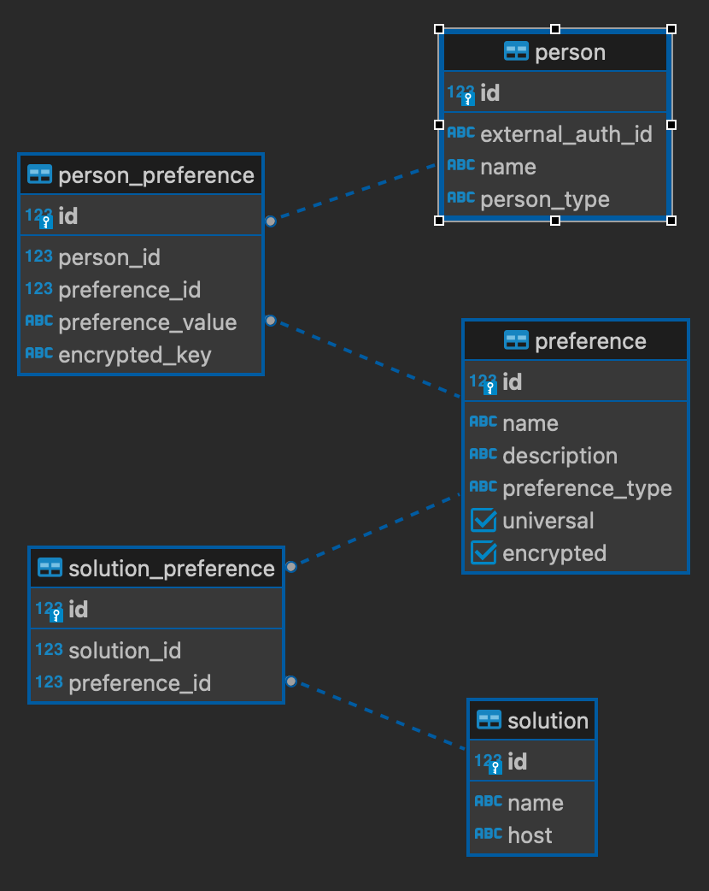

# Preference-manager

Centralized platform for preference management.
The system provides an API that allows authorised Apps to create Preferences configurations
and also fills these preferences with Consumer data.
The implementation is not yet complete.

## Context diagram
The use case of the system is:

## Container Architecture

## Design choices

* I decided to build one .NET service for the system in order to take advantage of one centralise database system and domain model.
That simplifies significant the transaction management and concurrency of the system.
I designed a second solution with microservices in the section performance [optimizations](##performance-optimizations).

* I followed the Clean Architecture for the design of my service. It has the following layers (class libraries):
  * API
  * UseCase (Application)
  * Domain
  * Infrastructure  
As the Clean architecture suggests alla layers have access to Domain and Domain only to itself.
Infrastructure contains all the external services such as the DB and cache Connection so is decoupled from rest of the service.
* Multiple preferences can apply to multiple solutions. This is making the domain more complex but is a more realistic scenario.
* Preference configurations are stored in a single table (preference) and belong in the same domain model.
Universal preferences are distinct by a boolean flag. I chose this to optimise queries that need all the preferences. 
And also instead of connecting a universal preference with all the available solution we can identify it just by the flag
* For optimisation I added a redis cache storing the actual values for ConsumerPreferences in order to avoid contecting to the database and use relational queries to connect preference configurations and preference values.
* Unfortunately the functionality is not completed. 

### Domain model
* **Preferences**  
Contains all information related to the configuration of a preference, such the type of the description. If it is a boolean flag or text.
It also contains an encrypted flag if the preference is sensitive and should be stored encrypted in our db.
* **Person**  
Contains information about the user such as the externalAuthId that is used for authentication by auth0
* **Solution**
Contains minimum information for the solution and the preference that can be applied to it.
* **PersonPreference**  
Contains the actual preference of the consumer. Depending the preferenceType in preference it has the corresponding value.

## Database schema
The EER diagram of the database

## API Architecture
I split the api into 3 categories:
* universal-preferences:  
Contains the set of calls regarding the management of universal preferences(create, edit, get)
  * GET `/universal-preferences` gets all universal preference config
  * POST `/universal-preferences`
  * PUT `/universal-preferences/{id}`  updates a universal preference config
  * DELETE `/universal-preferences/{id}` 
* solution-preferences:  
Contains the set of calls regarding the solution specific preferences
  * GET `/solution-preferences/solutions/{id}` gets available preferences for a specific solution
  * POST `/solution-preferences`
  * PUT `/universal-preferences/{id}`  updates a universal preference
* consumer-preferences:  
Contains the set of calls rfor managing the values of consumer's preferences
  * GET `/person-preferences/persons/{id}` gets the filled preferences of a specific user
  * POST `/person-preferences` creates a consumer's preference.
  * PUT `/universal-preferences/{id}`  updates a consumer's preference

### Authentication & Authorization
For authentication & authorization I used the auth0 service provider. 

I assume that authentication is happening from the client services and apps directly with auth0.
Then the client services can reach preference-manager using the JWT that they acquire from auth0 API.
Another assumption is that each client app has one set of permissions

In Auth0 I created and use in the api the scopes:
* `read:universal_preferences`: all authorised users have this permission
* `edit:solution_preferences`: Only solution managers have this permission
* `read:solution_preferences`: all authorised users have this permission
* `edit:consumer_preferences`: Consumer apps have this permission and they also need the correct externalAuthId
* `read:consumer_preferences`: Consumer apps have this permission. It must be validated that the correct user tries to access a specific preferece

## Testing
I created only one unit and integration test as poc.
and some acceptance tests  in postman. 
They are in `acceptance-tests-preference-manager.json` and they can be easily attached to a CI pipeline

## Performance optimizations

With the appropriate time a more scalable solution that could handle more traffic from consumer applications could be:

